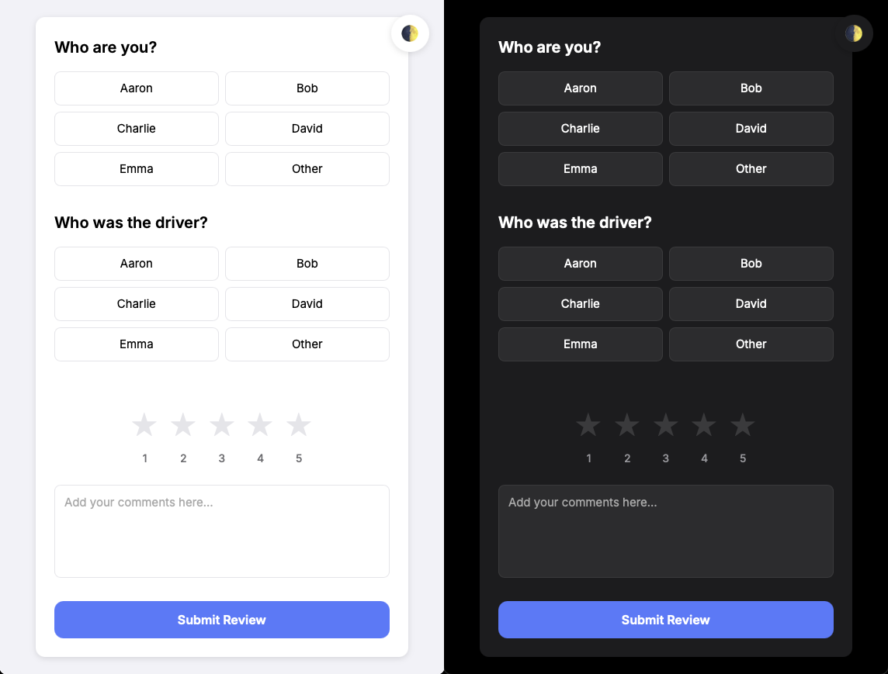

# Rate My Ride

A web application for collecting and managing family driver reviews through a web-based interface, with feedback being sent to a Discord channel.

## Overview

This application allows family members to submit reviews of drivers, including ratings and comments. All reviews are automatically sent to a designated Discord channel for easy tracking and visibility.

### Demo
[Demo Link](https://ratemyride-demo.d3v0ps.cloud)
# Screenshot

## Features

- Web-based form interface
- Mobile-responsive design
- Dynamic family member selection
- Dynamic driver selection
- Custom name input for non-listed members
- Interactive 5-star rating system
- Auto-populated review comments based on rating
- Comment submission
- Discord integration for review notifications
- RESTful API for programmatic access

## Technical Stack

### Frontend
- HTML5
- CSS3
- JavaScript
- Responsive design using flexbox

### Backend
- Node.js
- Express.js
- Multer for form data processing
- Discord webhook integration

### Infrastructure
- Docker
- Docker Compose
- GitHub Actions for CI/CD
- GitHub Container Registry

## Setup and Installation

### Using Pre-built Container
1. Pull the container image:
   ```bash
   docker pull ghcr.io/d3v0ps-cloud/ratemyride:latest
   ```
2. Create a `.env` file with required environment variables
3. Run the container:
   ```bash
   docker run -p 3000:3000 --env-file .env ghcr.io/d3v0ps-cloud/ratemyride:latest
   ```

### Local Development
1. Clone the repository
2. Install dependencies:
   ```bash
   npm install
   ```
3. Copy the environment file and configure:
   ```bash
   cp .env.example .env
   ```
4. Update the `.env` file with:
   - Your Discord webhook URL
   - List of family members (comma-separated)
   - Star rating descriptions (optional)
5. Start the server:
   ```bash
   npm start
   ```
6. Access the application at `http://localhost:3000`

### Docker Deployment
1. Clone the repository
2. Copy the environment file and configure:
   ```bash
   cp .env.example .env
   ```
3. Update the `.env` file with:
   - Your Discord webhook URL
   - List of family members (comma-separated)
   - Star rating descriptions (optional)
4. Build and start the Docker container:
   ```bash
   docker-compose up --build
   ```
5. Access the application at `http://localhost:3000`

## Using the Application

### Family Member and Driver Selection
The application provides two selection groups:
1. "Who are you?" - For selecting the reviewer
2. "Who was the driver?" - For selecting the person being reviewed

Each selection group includes:
- Radio buttons for pre-configured family members from the FAMILY_MEMBERS environment variable
- An "Other" option that, when selected:
  - Shows a text input field
  - Allows entering a custom name
  - The custom name will be used in place of "Other" in the review
  - The text input is required when "Other" is selected
  - The text input is hidden when any other option is selected

### Star Rating and Comments
- Select a rating from 1 to 5 stars
- When a star is selected:
  - The comment field is automatically populated with the corresponding description
  - The description comes from STAR_DESCRIPTIONS_* environment variables if set
  - Default descriptions are used if no custom ones are provided
- The populated comment can be modified before submission
- If unmodified, the auto-populated text will be submitted with the review

## API Documentation

### GET /api/family-members
Returns the list of configured family members.

#### Request
```http
GET /api/family-members
```

#### Response
```json
{
  "familyMembers": ["Mum", "Dad", "Oliver", "Jack", "Other"]
}
```

#### Example
```bash
curl http://localhost:3000/api/family-members
```

### GET /api/star-descriptions
Returns the configured descriptions for each star rating.

#### Request
```http
GET /api/star-descriptions
```

#### Response
```json
{
  "descriptions": {
    "1": "Terrible ride, I feared for my life",
    "2": "Below average driving, needs improvement",
    "3": "Average ride, got me there safely",
    "4": "Great ride, felt safe and comfortable",
    "5": "Excellent ride, perfect driving skills"
  }
}
```

#### Example
```bash
curl http://localhost:3000/api/star-descriptions
```

### POST /submit
Submits a new review.

#### Request
- Content-Type: `application/x-www-form-urlencoded` or `multipart/form-data`

#### Parameters
| Name | Type | Required | Description |
|------|------|----------|-------------|
| family_member | string | Yes | The name of the family member submitting the review (or custom name if "Other" was selected) |
| custom_family_member | string | No | Custom name when "Other" is selected for family member |
| driver | string | Yes | The name of the driver being reviewed (or custom name if "Other" was selected) |
| custom_driver | string | No | Custom name when "Other" is selected for driver |
| rating | number | Yes | Rating from 1 to 5 |
| comment | string | No | Additional comments about the ride (auto-populated based on rating if not modified) |

#### Response
- Success: Text response with "Thank you for your review!"
- Error: Text response with error message

#### Example using cURL
```bash
curl -X POST http://localhost:3000/submit \
  -H "Content-Type: application/x-www-form-urlencoded" \
  -d "family_member=Dad" \
  -d "driver=Mum" \
  -d "rating=5" \
  -d "comment=Great driving!"
```

#### Example using JavaScript Fetch
```javascript
fetch('http://localhost:3000/submit', {
  method: 'POST',
  headers: {
    'Content-Type': 'application/x-www-form-urlencoded',
  },
  body: new URLSearchParams({
    family_member: 'Dad',
    driver: 'Mum',
    rating: '5',
    comment: 'Great driving!'
  })
})
.then(response => response.text())
.then(result => console.log(result))
.catch(error => console.error('Error:', error));
```

#### Error Responses
- 400 Bad Request: Missing required fields
- 500 Internal Server Error: Failed to send to Discord

## Container Images

The application is automatically built and published to GitHub Container Registry using GitHub Actions.

### Available Tags
- `latest`: Latest build from the main branch
- `vX.Y.Z`: Release versions (e.g., v1.0.0)
- `vX.Y`: Minor version tags (e.g., v1.0)
- `sha-XXXXXXX`: Specific commit builds

### CI/CD Pipeline
The GitHub Actions workflow automatically:
1. Builds the Docker image
2. Runs tests (if any)
3. Publishes to GitHub Container Registry on:
   - Pushes to main branch
   - Release tags (v*)
4. Generates appropriate tags and labels

## Project Structure

```
ratemyride/
├── .github/
│   └── workflows/        # GitHub Actions workflows
│       └── docker-build.yml
├── public/
│   └── index.html       # Frontend interface
├── server.js            # Express server and API endpoints
├── package.json         # Project dependencies
├── Dockerfile           # Docker image configuration
├── docker-compose.yml   # Docker Compose configuration
├── .env.example         # Example environment variables
└── README.md           # Documentation
```

## Environment Variables

The application requires the following environment variables:

- `DISCORD_WEBHOOK_URL`: The webhook URL for your Discord channel
- `FAMILY_MEMBERS`: Comma-separated list of family members (e.g., "Mum,Dad,Oliver,Jack,Other")

Optional star rating description variables:
- `STAR_DESCRIPTIONS_1`: Description for 1-star rating
- `STAR_DESCRIPTIONS_2`: Description for 2-star rating
- `STAR_DESCRIPTIONS_3`: Description for 3-star rating
- `STAR_DESCRIPTIONS_4`: Description for 4-star rating
- `STAR_DESCRIPTIONS_5`: Description for 5-star rating

If star descriptions are not provided, default descriptions will be used:
```
1 star: "Terrible ride, I feared for my life"
2 stars: "Below average driving, needs improvement"
3 stars: "Average ride, got me there safely"
4 stars: "Great ride, felt safe and comfortable"
5 stars: "Excellent ride, perfect driving skills"
```

These can be configured by:
1. Creating a `.env` file based on `.env.example`
2. Setting the variables in your environment
3. Passing them through Docker Compose

## System Requirements

### Functional Requirements

#### User Interface
- Web-based form interface
- Responsive and mobile-friendly design
- Dynamic family member selection from configured list
- Dynamic driver selection from configured list
- Custom name input for "Other" selections
- 5-star rating system with auto-populated review text
- Comment text area
- Submit button

#### Data Processing
- Form submission handling
- Data validation
- Discord webhook integration
- Submission confirmation
- Custom name handling for "Other" selections

### Non-Functional Requirements

#### Performance
- Form submissions process within 2 seconds
- Interface loads within 1 second

#### Security
- Secure webhook URL handling
- Form validation against malicious submissions

#### User Experience
- Clean, intuitive interface
- Consistent styling
- Clear visual feedback
- Responsive design for all screen sizes
- Auto-populated review text based on rating
- Seamless custom name input for "Other" selections

#### Browser Compatibility
- Support for modern web browsers
- Consistent cross-platform experience

## API Integration

### Discord Webhook
- Sends formatted messages to Discord channel
- Message format: "New review from [Family Member]: [Rating] stars. The Driver was: [Driver]. Comment: [Comment]"

## Error Handling
- Form validation errors
- Network connectivity issues
- Discord API rate limits
- Failed submission handling
- Missing environment variables handling
- Invalid custom name inputs

## Success Criteria
- Successful form submissions
- Accurate delivery of reviews to Discord
- User-friendly interface
- Responsive design across devices
- Clear submission confirmation
- Dynamic loading of family members
- Auto-populated review text based on rating
- Proper handling of custom names for "Other" selections

## License
MIT License
